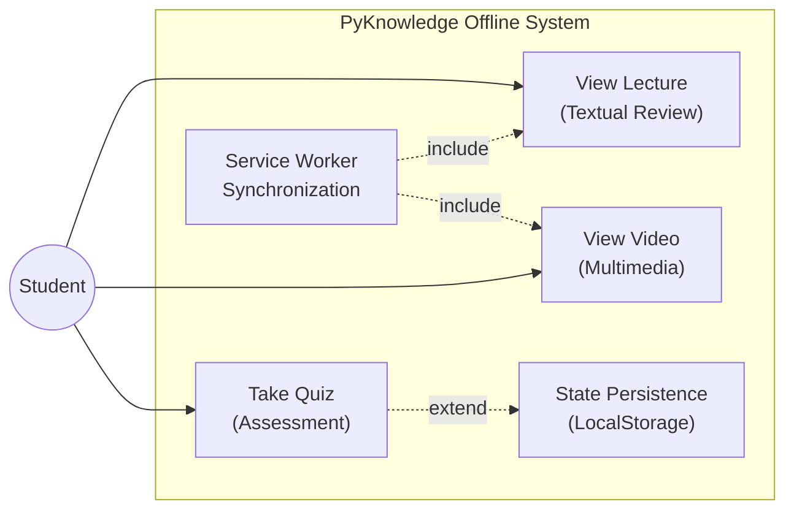
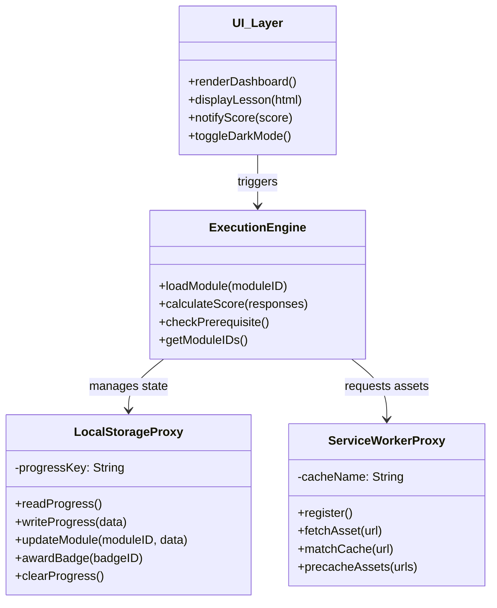
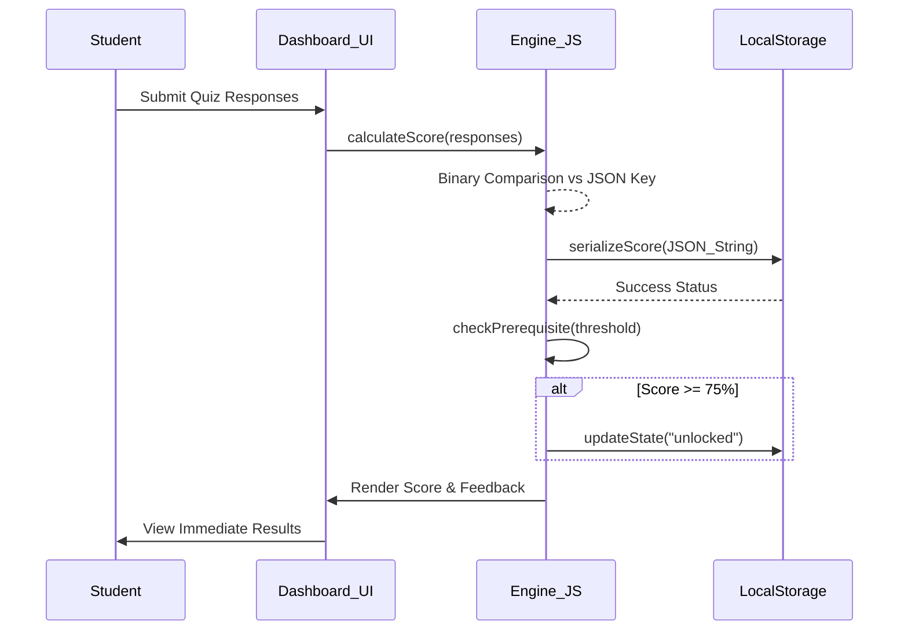
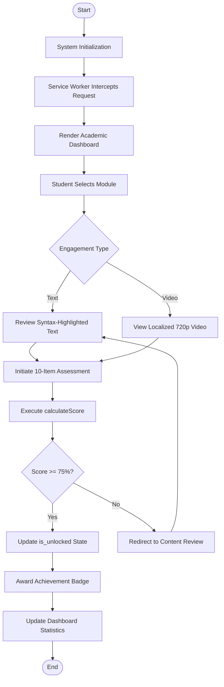
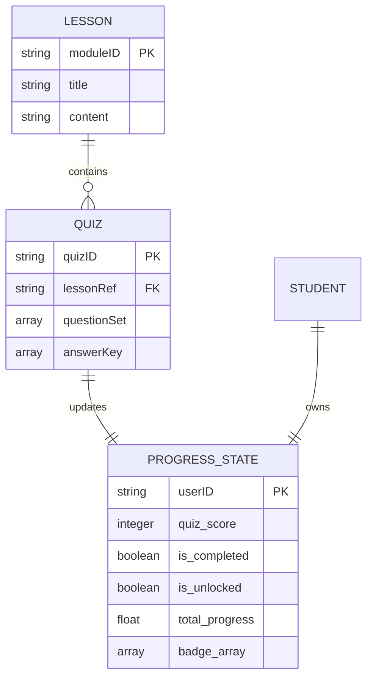

# PyKnowledge System Architecture

## 4.7 Object Modeling and Systemic Program Specifications

In the architectural engineering of the **PyKnowledge** platform, object modeling serves as the definitive structural blueprint for translating the pedagogical requirements of the **Commission on Higher Education (CHED)** into a high-performance, client-side execution engine. This methodology utilizes the Unified Modeling Language (UML) to establish a rigorous mapping of system behaviors, class structures, and chronological request-response lifecycles localized within the browser's security sandbox.

---

### 4.7.1 Use Case Diagram: User Interaction and Administrative Governance

The **Use Case Diagram** defines the functional boundaries of the platform, identifying the **Student** as the primary external entity.

**Primary Instructional Use Cases:**
- **View Lecture (Textual Review):** Triggers `loadModule()` to fetch lesson data from `lessons.json`.
- **View Video (Multimedia Consumption):** Serves 720p H.264 lectures from the Cache API via the Service Worker.
- **Take Quiz (Competency Validation):** Validates responses against `quizzes.json` via `calculateScore()`.

**Administrative Isolation:**
- Service Worker Versioning and Terminal Synchronization operate transparently to the user.
- LocalStorage persists quiz results as a byproduct of the "Take Quiz" use case.

---

### 4.7.2 Class Diagram: Structural Implementation Details

The **Class Diagram** maps the object structures for the application's Vanilla JavaScript (ES6+) execution engine operating entirely within the browser's security sandbox.

**Core Functional Objects:**
- **`loadModule(moduleID)`** — fetches lesson data from `lessons.json`; prevents hard-coding of content.
- **`calculateScore(responses)`** — binary comparison against `quizzes.json` answer key; updates `pyknowledge_progress` in LocalStorage.
- **`checkPrerequisite()`** — enforces ≥ 75% score threshold before unlocking advanced modules (OOP, decorators, etc.).

---

### 4.7.3 Sequence Diagram: Chronological Interaction and State Persistence

The **Sequence Diagram** documents the definitive chronological interaction between UI components and the LocalStorage API, verifying "offline-first" integrity.

**Instantaneous State Persistence Workflow:**
1. **Request Initiation:** UI submits student responses after quiz completion.
2. **Evaluation:** `calculateScore()` performs binary comparison against `quizzes.json`.
3. **Serialization:** Score is persisted to `localStorage['pyknowledge_progress']`.
4. **Logic-Driven Unlocking:** `checkPrerequisite()` reads state and, if ≥ 75%, writes `is_unlocked = true`.

---

### 4.7.4 Activity Modeling: Procedural Logic and Lifecycle Activation

The **Activity Diagram** governs the logic-driven progression through six deterministic stages:

1. **System Initialization** — Service Worker serves app shell from Cache API.
2. **Module Selection** — Dashboard reads LocalStorage to render unlocked modules.
3. **Instructional Engagement** — Student reviews syntax-highlighted text and 720p video.
4. **Competency Assessment** — 10-item multiple-choice quiz is presented.
5. **Score Evaluation** — `calculateScore()` validates responses client-side.
6. **Gatekeeping** — If ≥ 75%, next module is unlocked; otherwise redirected to review.

---

## 4.8 Data Design and Logical Entity Relationship Architecture

PyKnowledge intentionally excludes traditional RDBMS systems to maintain "offline-first" integrity. All data is managed through browser-native APIs.

### 4.8.1 Entity Relationship Diagram (ERD)

The platform manages a deterministic **1:1 relationship** between a localized browser profile and its serialized progress data. Three primary entities form the logical model:

---

### 4.8.2 Comprehensive Data Dictionary

#### I. Static Content Repositories (JSON Structures)

| File Name | Field Name | Data Type | Description |
| :--- | :--- | :--- | :--- |
| **lessons.json** | `moduleID` | String | Unique identifier for the 15 modules (e.g., `"variables"`, `"oop"`). |
| | `title` | String | Official curricular title compliant with CHED standards. |
| | `content` | String/HTML | Structured instructional text with syntax-highlighted code blocks. |
| **quizzes.json** | `quizID` | String | Unique identifier linking the assessment to a specific module. |
| | `lessonRef` | String | Foreign reference to the `moduleID` in `lessons.json`. |
| | `questionSet` | Array | Collection of 10 multiple-choice questions per assessment set. |
| | `answerKey` | Array | Binary comparison key used by the `calculateScore()` function. |

#### II. Dynamic State Persistence (LocalStorage Structure)

Systemic state transitions are managed through the **`localStorage['pyknowledge_progress']`** key, persisted as a single JSON string.

| Logical Data Element | Technical Key | Data Type | Description |
| :--- | :--- | :--- | :--- |
| **Numeric Score** | `quiz_score` | Integer | Percentage result (0–100) calculated after each assessment. |
| **Completion Status** | `is_completed` | Boolean | Binary flag indicating if the module quiz has been submitted. |
| **Module Unlock State** | `is_unlocked` | Boolean | `true` only if `checkPrerequisite()` returned ≥ 75% threshold. |
| **Learning Statistics** | `total_progress` | Float | Calculated percentage of overall curriculum completion (0.0–1.0). |
| **Achievement Badges** | `badge_array` | Array | Strings representing digital awards based on mastery thresholds. |

---

## Implementation File Map

| File | Role | Diagram Reference |
| :--- | :--- | :--- |
| `src/engine.js` | `ExecutionEngine` class — `loadModule()`, `calculateScore()`, `checkPrerequisite()` | Class Diagram §4.7.2 |
| `src/storage.js` | `LocalStorageProxy` class — reads/writes `pyknowledge_progress` | Class Diagram §4.7.2 |
| `src/cache.js` | `ServiceWorkerProxy` class — Cache API interface | Class Diagram §4.7.2 |
| `src/ui.js` | `UI_Layer` class — dashboard, lesson, quiz, score rendering | Class Diagram §4.7.2 |
| `data/lessons.json` | 15 Python curriculum modules (CHED-compliant) | ERD §4.8.1, Data Dictionary §4.8.2 |
| `data/quizzes.json` | 15 × 10-item assessment sets with answer keys | ERD §4.8.1, Data Dictionary §4.8.2 |
| `service-worker.js` | Offline-first caching; app shell + video pre-cache | Use Case §4.7.1, Activity §4.7.4 |
| `index.html` | Application entry point; bootstraps the object graph | Activity §4.7.4 |
| `styles/main.css` | Light/dark theme CSS with design tokens | — |
